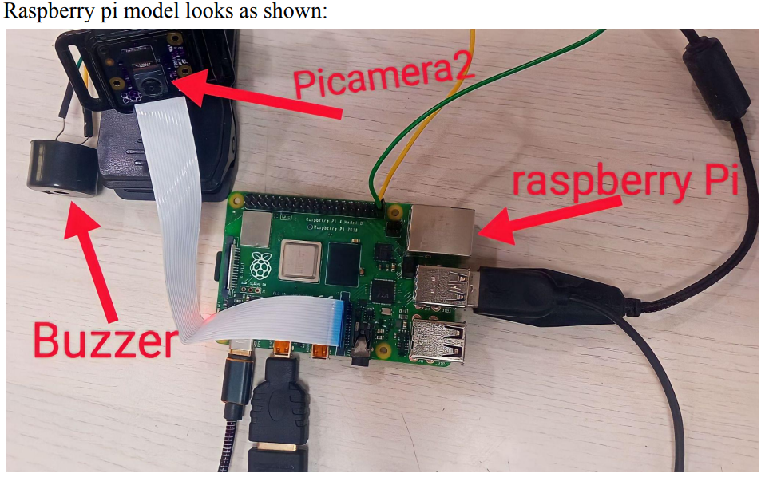
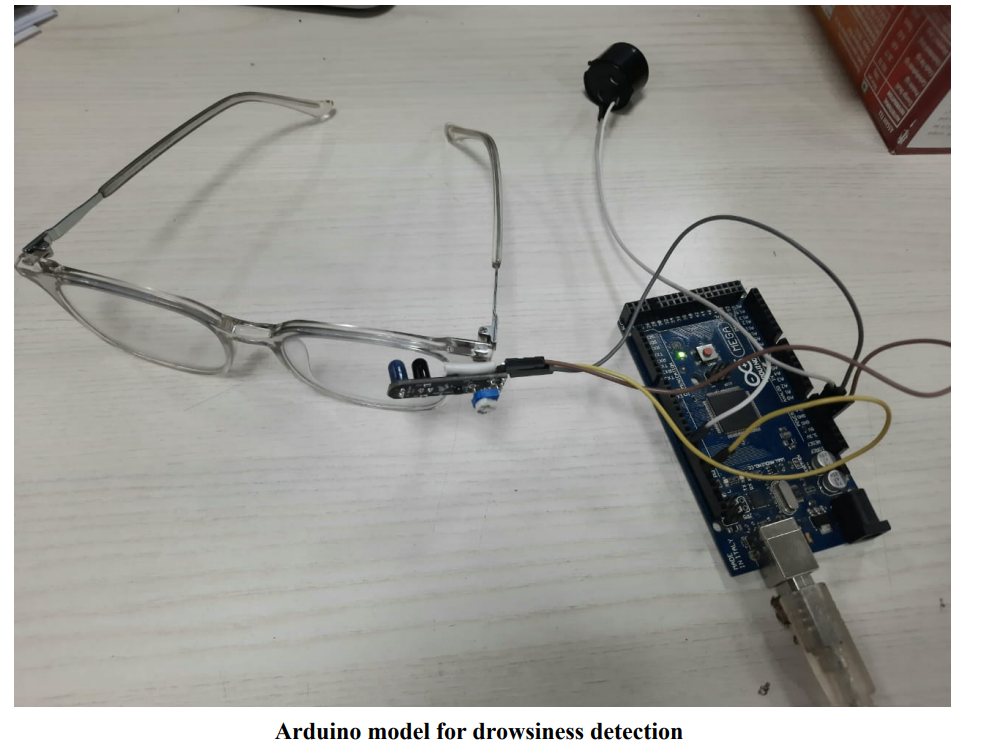
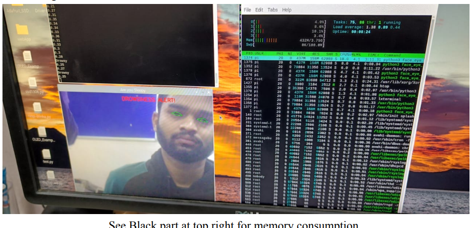
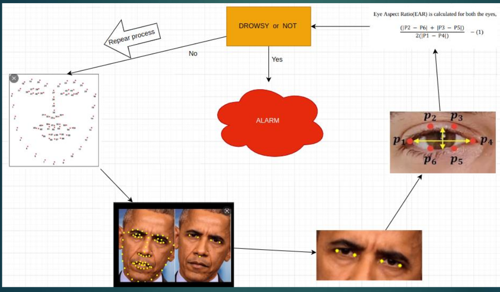
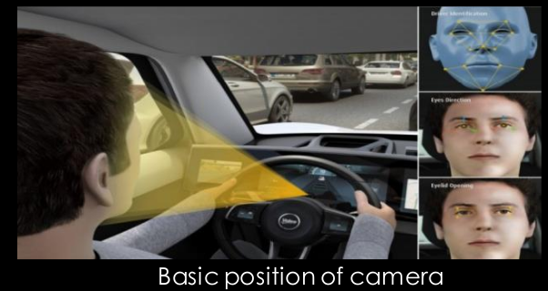
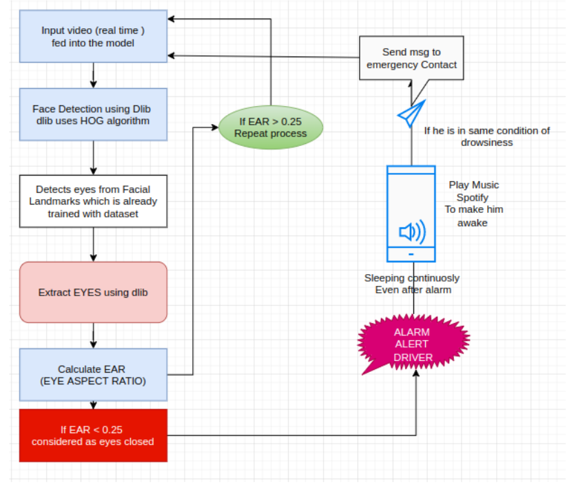
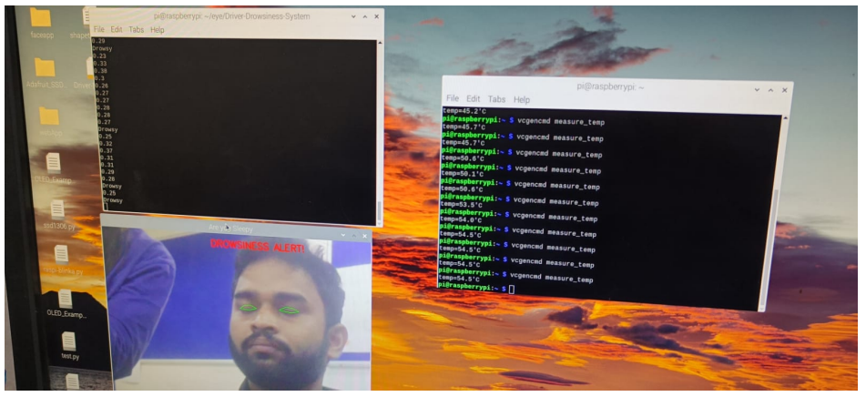

**Project Overview:**

This project addresses the critical issue of drowsy driving, which accounts for 40% of annual road accidents in our country. Drowsiness in drivers is primarily caused by factors like fatigue, loss of concentration, lack of sleep, and can lead to accidents and loss of lives. Additionally, workers at mining sites are also affected by drowsiness-related problems. To tackle this issue, we've developed a comprehensive drowsiness detection system.

**Key Highlights:**

- **Raspberry Pi Prototype (Part 1):** We initially created a real-time drowsiness detection system using a Raspberry Pi, Picamera, and buzzer. The system employs advanced algorithms for face detection and eye blink detection, with a focus on efficient eye aspect ratio (EAR) computation. We utilized OpenCV and Python for driver drowsiness detection and Dlib for facial landmark detection.

- **Arduino Mega Prototype (Part 2):** In the second phase, we optimized our prototype by transitioning to an Arduino Mega board. This significantly reduced memory and computational overhead, making the system more cost-effective and power-efficient. IR sensors, integrated into eyeglasses worn by the driver, detect eye blinks and determine drowsiness. The system sounds an alarm to alert drowsy drivers.

**Benefits:**

- Real-time driver drowsiness detection to prevent accidents.
- Efficient use of hardware resources, reducing costs.
- Seamless transition to an Arduino-based solution for improved performance.
- Reduction in memory and computational overhead.

## Screenshots

Include some screenshots of your project to show how it looks and works.

